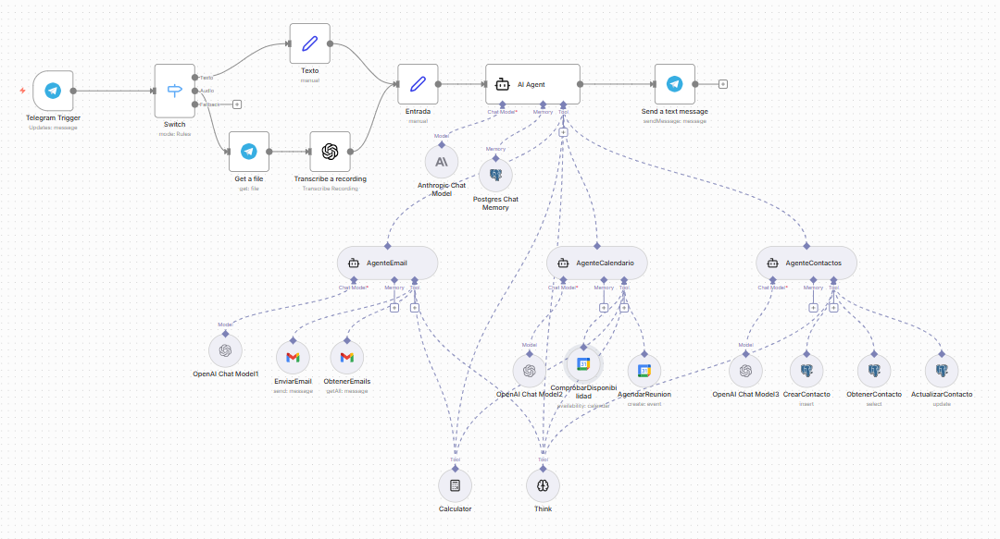
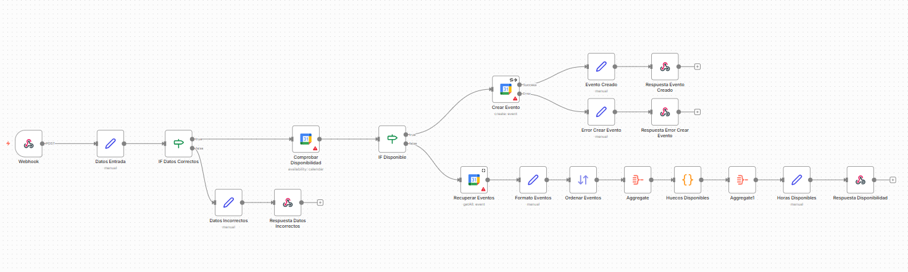
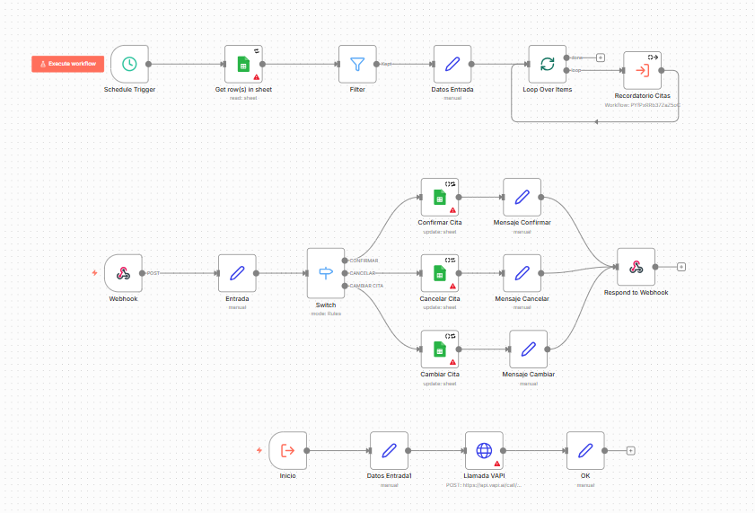
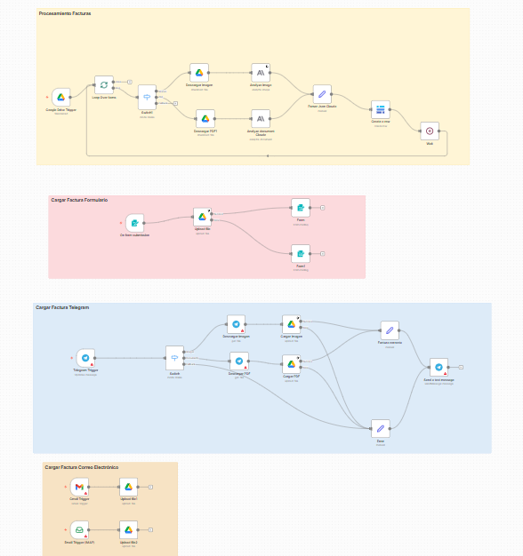
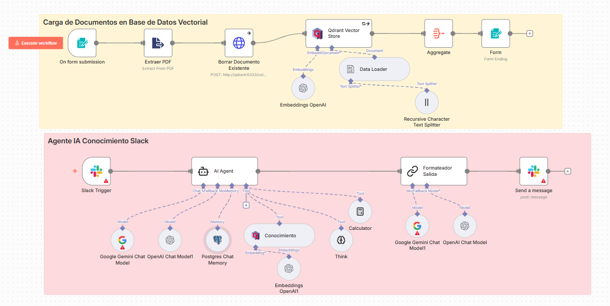
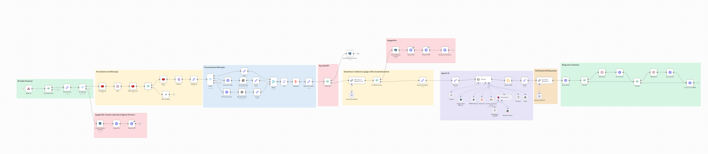

# n8n Production Workflows Portfolio
## AI Orchestration & Advanced Automation Systems

> 📚 **Technical documentation** for 6 production n8n workflows showcasing expert-level automation, AI agent orchestration, voice AI, RAG systems, and enterprise integrations.

---

## 📋 Table of Contents

- [Overview](#overview)
- [Workflows](#workflows)
  - [1. Multi-Agent Personal Assistant](#1-multi-agent-personal-assistant)
  - [2. Voice AI Appointment System (VAPI)](#2-voice-ai-appointment-system-vapi)
  - [3. Voice AI Outbound System (VAPI)](#3-voice-ai-outbound-system-vapi)
  - [4. Intelligent Invoice Processing (OCR)](#4-intelligent-invoice-processing-ocr)
  - [5. RAG Knowledge Base (Slack)](#5-rag-knowledge-base-slack)
  - [6. Enterprise WhatsApp Bot](#6-enterprise-whatsapp-bot)
- [Technical Stack](#technical-stack)
- [Architecture Patterns](#architecture-patterns)
- [About This Repository](#about-this-repository)
- [Contact](#contact)

---

## 🎯 Overview

This repository documents **6 production n8n workflows** built over 2 years of professional automation consulting. Each workflow is documented with detailed technical explanations, architecture diagrams, and implementation patterns.

### 📊 Portfolio Metrics

| Metric | Value |
|--------|-------|
| **Production Systems** | 6 major workflows |
| **Total Complexity** | 200+ nodes across all systems |
| **Largest Workflow** | 4,113 lines (100+ nodes) |
| **Technologies Integrated** | 15+ platforms |
| **Documentation** | 120+ pages of technical details |

### 💎 What You'll Find Here

- **Complete technical documentation** for each workflow
- **Architecture diagrams** and data flow explanations
- **Production patterns** (error handling, state machines, queues)
- **Real-world implementations** (not tutorials or demos)
- **Advanced techniques** (multi-agent AI, voice AI, RAG systems)

---

## 🚀 Workflows

### 1. Multi-Agent Personal Assistant

A sophisticated **multi-agent AI system** that acts as a personal assistant managing emails, calendar appointments, and contacts through natural conversation via Telegram. The architecture uses an orchestrator agent that coordinates three specialized sub-agents.

**Key Features:**
- Voice input support via Whisper transcription
- Multi-agent orchestration (1 orchestrator + 3 sub-agents)
- PostgreSQL for contacts database and conversation memory
- Multi-LLM coordination (Google Gemini + GPT-4.1-mini)
- Telegram interface with natural language processing

**Technical Highlights:**
- 30+ nodes with complex routing logic
- Advanced AI agent orchestration patterns
- Database CRUD operations (PostgreSQL)
- Voice-to-text pipeline integration
- Stateful conversation memory across sessions

**Complexity:** ⭐⭐⭐⭐⭐ Expert

📖 **[Read Full Technical Documentation](./docs/multi-agent-assistant.md)** (20 pages)

---

### 2. Voice AI Appointment System (VAPI)

Production voice AI system that **automates appointment scheduling via phone calls** using VAPI. The system checks Google Calendar availability in real-time, creates events automatically, and logs all call data including transcriptions and audio to NocoDB for analytics.

**Key Features:**
- VAPI integration for bidirectional voice communication
- Real-time Google Calendar availability checking
- Automatic event creation with multiple attendees
- Complete call analytics (transcriptions, evaluations, recordings)
- Binary data handling for audio file storage
- Sophisticated error handling with retry logic

**Technical Highlights:**
- Webhook POST handling with response nodes
- Complex conditional logic (available vs busy slots)
- Data aggregation for time slot calculation
- Binary data management (audio downloads)
- NocoDB integration for call logging and analytics

**Complexity:** ⭐⭐⭐⭐⭐ Expert

📖 **[Read Full Technical Documentation](./docs/vapi-appointment-system.md)** (18 pages)

---

### 3. Voice AI Outbound System (VAPI)

Automated outbound calling system that **reminds customers about upcoming appointments** via VAPI. The system runs on a schedule, reads appointments from Google Sheets, filters pending ones, calls customers, and processes their responses through a callback webhook.

**Key Features:**
- Scheduled execution (weekdays at 18:00)
- Google Sheets as operational database
- State machine tracking (Pending/Confirmed/Cancelled)
- VAPI outbound calls with variable injection
- Callback handling with 3 response routes
- Parent-child workflow pattern for modularity

**Technical Highlights:**
- Parent-child workflow orchestration
- State management via spreadsheet
- Batch processing with loops
- Error handling (continues on failure)
- Modular architecture for reusability

**Complexity:** ⭐⭐⭐⭐ Advanced

📖 **[Read Full Technical Documentation](./docs/vapi-outbound-system.md)** (15 pages)

---

### 4. Intelligent Invoice Processing (OCR)

Multi-channel invoice processing system that uses **Claude Opus 4 for OCR** and structured data extraction. Accepts invoices via Google Drive, web form, or Telegram, automatically extracts 15+ fields with validation, categorizes expenses, and updates the accounting database.

**Key Features:**
- Multi-channel input (Google Drive, web form, Telegram)
- Claude Opus 4 OCR for advanced document understanding
- Structured extraction of 15+ fields with validation
- Automatic expense categorization
- Format validation (dates, amounts, tax rates)
- Error handling with 5-attempt retry logic

**Technical Highlights:**
- Advanced prompt engineering for structured outputs
- Binary data workflows (PDF + images)
- Form integration with completion messages
- Multi-trigger architecture (3 input channels)
- Precise formatting instructions for AI models

**Complexity:** ⭐⭐⭐⭐⭐ Expert

📖 **[Read Full Technical Documentation](./docs/invoice-ocr-system.md)** (15 pages)

---

### 5. RAG Knowledge Base (Slack)

Complete **RAG (Retrieval Augmented Generation) system** that enables Slack users to query a knowledge base of documents with natural language. The system includes both document ingestion (upload → chunk → embed → store) and retrieval (query → search → generate response) pipelines using Qdrant vector database.

**Key Features:**
- Complete RAG pipeline (ingestion + retrieval)
- Qdrant vector database for semantic search
- OpenAI embeddings (text-embedding-3-large, 1536 dimensions)
- Recursive text splitting (400 chars, 100 overlap)
- Document versioning (deletes old before re-upload)
- Slack integration (@mention triggers)
- AI agent with vector retrieval as tool (topK=20)
- PostgreSQL memory for multi-turn conversations

**Technical Highlights:**
- End-to-end RAG architecture
- Metadata management for documents
- Markdown-aware text splitting
- Session-based memory system
- Multi-tool AI agent (retrieval + reasoning + calculation)

**Complexity:** ⭐⭐⭐⭐⭐ Expert

📖 **[Read Full Technical Documentation](./docs/rag-slack-system.md)** (20 pages)

---

### 6. Enterprise WhatsApp Bot

**⭐ FLAGSHIP PROJECT** - Production-grade WhatsApp chatbot serving a law firm with **real customer conversations**. This is the most complex workflow in the portfolio (4,113 lines, 100+ nodes), demonstrating enterprise-level architecture with Redis message queuing, sophisticated deduplication logic, AI agent orchestration, RAG knowledge base, calendar integration, and CRM lead management.

**Key Features:**
- Redis message queue with 15-second batching window
- Sophisticated message deduplication algorithm
- State machine (bot on/off, conversation routing)
- AI agent orchestrator with multiple capabilities:
  - RAG knowledge base (Qdrant)
  - Calendar booking (MCP integration)
  - Lead creation (CRM)
- Chatwoot platform integration for agent handoff
- PostgreSQL conversation memory

**Technical Highlights:**
- Production-grade message queue (Redis)
- Complex webhook processing and validation
- Multi-tool AI orchestration
- Enterprise chat platform integration
- Comprehensive error handling and retry logic

**Complexity:** ⭐⭐⭐⭐⭐ Expert (Most Complex)

📖 **[Read Full Technical Documentation](./docs/enterprise-whatsapp-bot.md)** (30 pages)

---

## 🛠️ Technical Stack

### Core Technologies
**n8n** - Workflow automation engine (expert-level)  
**LangChain** - AI agent framework  
**PostgreSQL** - Database and memory storage  
**Redis** - Message queue and caching

### AI & Machine Learning
**OpenAI** (GPT-4, GPT-4.1-mini, Whisper, Embeddings)  
**Claude** (Opus 4 for OCR)  
**Google Gemini** (Chat models)  
**Qdrant** - Vector database for RAG

### Voice AI
**VAPI** - Voice AI platform  
**OpenAI Whisper** - Speech-to-text  
**ElevenLabs** - Text-to-speech

### Databases & Storage
**PostgreSQL** - Primary database, chat memory  
**Supabase** - Managed PostgreSQL  
**NocoDB** - No-code database interface  
**Redis** - Queue and state management  
**Qdrant** - Vector embeddings storage  
**Google Sheets** - Operational databases

### Communication Platforms
**Telegram** - Bot API  
**Slack** - App integration  
**WhatsApp** - Via Chatwoot  
**Chatwoot** - Customer engagement platform

### Other Integrations
**Google Calendar API**, **Google Drive API**, **Google Sheets API**, **HTTP/Webhooks**, **n8n Form Trigger**

---

## 🏗️ Architecture Patterns

These workflows demonstrate several advanced patterns:

### Pattern 1: Multi-Agent Orchestration
Orchestrator agent analyzes user intent, selects appropriate sub-agent, and synthesizes final response. Used in Multi-Agent Assistant.

### Pattern 2: Message Queue with Deduplication
Incoming messages are pushed to Redis queue with wait period, then popped and deduplicated to prevent duplicate responses. Used in WhatsApp Bot.

### Pattern 3: State Machine
States track workflow status (Pending/Confirmed/Cancelled) with transitions triggered by user actions, time-based events, or external systems. Used in VAPI Outbound and WhatsApp Bot.

### Pattern 4: Parent-Child Workflow
Parent fetches batch of items, loops through each, executing child workflow for individual processing. Used in VAPI Outbound.

### Pattern 5: RAG Pipeline
Document ingestion (extract → split → embed → store) and retrieval (query → embed → search → generate). Used in RAG Slack System and WhatsApp Bot.

---

## 📚 About This Repository

### Purpose

This repository serves as **technical documentation** for my n8n automation portfolio. Each workflow is documented with:

- Detailed architecture explanations
- Node-by-node implementation details
- Design decisions and rationale
- Performance metrics and optimizations
- Production deployment considerations

### Why No Workflow Files?

The actual workflow JSON files contain:
- Sensitive credentials and API keys
- Client-specific configurations
- Production database connections
- Private webhook URLs

Instead of sharing sanitized versions (which lose context), I've created **comprehensive documentation** that explains:
- How each system works
- Why architectural decisions were made
- How to implement similar patterns
- Best practices learned from production

### Learning from These Workflows

Each documentation includes:
- ✅ Complete architecture diagrams
- ✅ Step-by-step implementation guides
- ✅ Code examples and configurations
- ✅ Testing strategies
- ✅ Production deployment tips
- ✅ Common pitfalls and solutions

---

## 💼 About Me

**Manuel Gálvez del Postigo Fernández**  
Senior n8n Automation Engineer | AI Orchestration Specialist

- 🎓 Industrial Electronics Engineering + Master's (Renewable Energy) + Master's (Blockchain) + MBA
- 💼 2 years building production n8n systems (15+ deployed)
- 🌍 Based in Granada, Spain (EU timezone)
- 🗣️ Spanish (native), English (C1)

### Specializations

- Complex n8n workflow development (30-100+ nodes)
- Multi-agent AI orchestration
- Voice AI systems (VAPI, Retell)
- RAG systems and knowledge bases
- Enterprise chat automation
- API orchestration and integration

---

## 📞 Contact & Collaboration

### Let's Connect

- 💼 **LinkedIn:** [https://www.linkedin.com/in/manuel-g%C3%A1lvez-del-postigo-fern%C3%A1ndez-525739135/]
- 📧 **Email:** [manuelgpw@gmail.com]
- 🐙 **GitHub:** [@manusp5-source](https://github.com/manusp5-source)

### Available For

- 🔧 Custom n8n workflow development
- 🤖 AI agent implementation (multi-agent, RAG, voice)
- 🎙️ Voice AI integration (VAPI, Retell, custom solutions)
- 📚 Knowledge base systems (RAG, vector databases)
- 🔗 Complex API orchestration
- 📖 Training and mentorship

**Availability:** Flexible for remote projects

---

**⭐ If you find these workflows helpful, please star this repository!**

*Last Updated: December 2025*

